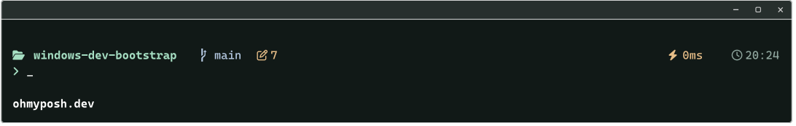
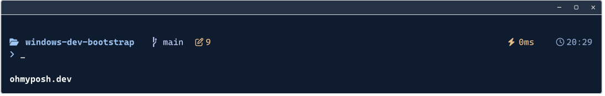
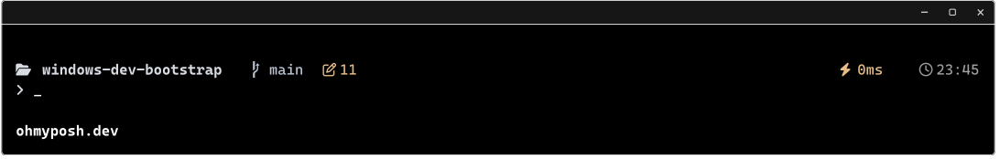

# Windows Dev Bootstrap

A repeatable Windows terminal setup with PowerShell 7, useful shell defaults,
and three matching themes: **Ava Harbor (Blue)**, **Ava Grove (Green)**, and **Ava Midnight (Black)**.

## Themes

All three themes share the same two-line layout, Nerd Font icons, spacing, and
behavior. Only the colors change, including the terminal background, prompt,
syntax highlighting, suggestions, and selection.

**Ava Grove (Green)** — charcoal green with soft mint accents.



**Ava Harbor (Blue)** — deep navy with soft blue accents, inspired by classic PowerShell.



**Ava Midnight (Black)** — a true black background with soft silver text and icons.



These are Oh My Posh prompt renders; Git counts illustrate the layout.

- Folder or home icon and current folder.
- Git branch, pencil with working-change count, and checked square with staged-change count.
- Ahead/behind and stash indicators when relevant.
- Lightning icon for command duration; clock icon for 24-hour time.
- A separate input line, with a coral prompt after a failed command.
- Duration and clock hide when the right-hand group cannot fit.

## Install

The installer sets up PowerShell 7, Windows Terminal, Oh My Posh, CaskaydiaCove
Nerd Font, Git, and PSReadLine. It installs all three themes under
`~/.config/windows-dev-bootstrap` and makes **Ava Harbor** the default.
No repository checkout is required.

Open the built-in **Windows PowerShell** and run:

```powershell
$installer = Join-Path $env:TEMP 'windows-dev-bootstrap.ps1'
Invoke-WebRequest "https://raw.githubusercontent.com/AvaSharkawy/windows-dev-bootstrap/main/install.ps1?v=$([DateTimeOffset]::UtcNow.ToUnixTimeSeconds())" -UseBasicParsing -OutFile $installer
powershell.exe -NoLogo -NoProfile -ExecutionPolicy Bypass -File $installer
```

To choose another initial default, add `-Theme Green` or `-Theme Black` to the last command.
Use `-SkipGit` to skip Git installation or `-SkipTerminalConfiguration` to leave
Terminal settings alone. The execution-policy override applies only to that
child process.

Existing managed files, the PowerShell profile, and Terminal settings are backed
up before replacement. Installing replaces the current-user PowerShell 7 profile;
keep any personal additions in its backup. Close and reopen Windows Terminal
after setup so the new font and profiles are available.

## Switch themes

Click the dropdown arrow beside **+** in Windows Terminal and choose
**Ava Harbor**, **Ava Grove**, or **Ava Midnight**. Each opens a tab with matching prompt,
background, and typing colors. Existing tabs keep their own theme; **Ctrl+Tab**
moves between tabs.

Upgrading renames the previous Sharkawy profiles in place, preserving their IDs
and your default selection. The `-Theme Green` and `-Theme Blue` commands and
existing configuration filenames remain compatible.

To change the default for new windows, open **Settings → Startup → Default
profile**, choose either theme, and save.

You can also launch a theme from PowerShell 7:

```powershell
$themeSwitcher = Join-Path $HOME '.config\windows-dev-bootstrap\themes.ps1'
& $themeSwitcher -Theme Blue
& $themeSwitcher -Theme Green
& $themeSwitcher -Theme Black
```

Add `-SetDefault` to make the selected theme the default, or `-NoLaunch` to
register it without opening a window. Other profiles, fonts, and shortcuts are
preserved. Changes to `settings.json` normalize its formatting and remove JSON
comments; an exact backup is saved first.

## Update an existing setup

```powershell
$updater = Join-Path $env:TEMP 'windows-dev-bootstrap-update.ps1'
Invoke-WebRequest "https://raw.githubusercontent.com/AvaSharkawy/windows-dev-bootstrap/main/update.ps1?v=$([DateTimeOffset]::UtcNow.ToUnixTimeSeconds())" -UseBasicParsing -OutFile $updater
powershell.exe -NoLogo -NoProfile -ExecutionPolicy Bypass -File $updater
```

This upgrades the terminal packages, installs/verifies the Nerd Font, refreshes
all three themes and the managed PowerShell profile, and registers all three Terminal
profiles. Your chosen default profile is preserved. Add
`-SkipTerminalConfiguration` to skip Terminal settings changes.

Restart Windows Terminal after updating. When upgrading from the original
single-theme setup, choose one of the new profiles from the dropdown to get the
complete appearance. Updating also moves any checkout-based preview profiles
to the installed files, using their existing IDs rather than creating duplicates.

## Try changes from a local checkout

With the prerequisites installed, run these commands from this repository in
PowerShell 7:

```powershell
.\preview.ps1 -Theme Blue
.\preview.ps1 -Theme Green
.\preview.ps1 -Theme Black
```

The preview uses the same three profile IDs and names, but points them at this
checkout and starts in the repository folder. Your installed PowerShell profile
and default selection are preserved. Keep the checkout in place while using
these profiles, or rerun the installed theme switcher to point them back at the
installed files. Omitting `-Theme` selects Blue.

Try `Get-ChildItem`, `git status`, `Start-Sleep -Seconds 2`, and `cd ~`.
For Windows Terminal Preview or portable installations, pass their actual
`settings.json` path using `-SettingsPath` when registering or removing a theme.
The installer and updater target the standard Microsoft Store Terminal location.

To remove just one preview, close its tabs and run:

```powershell
.\preview.ps1 -Theme Blue -Remove
```

Choose a different default first if that profile is currently your default.
Removing one theme preserves the others and any shared palette still in use.

## Uninstall

```powershell
$uninstaller = Join-Path $env:TEMP 'windows-dev-bootstrap-uninstall.ps1'
Invoke-WebRequest "https://raw.githubusercontent.com/AvaSharkawy/windows-dev-bootstrap/main/uninstall.ps1?v=$([DateTimeOffset]::UtcNow.ToUnixTimeSeconds())" -UseBasicParsing -OutFile $uninstaller
powershell.exe -NoLogo -NoProfile -ExecutionPolicy Bypass -File $uninstaller
```

This removes the three Terminal profiles and their unused palettes, resets the
default to standard PowerShell 7 if needed, removes installed configuration, and
restores the most recent PowerShell profile backup when available.
Add `-RemovePackages` to also remove PowerShell 7, Windows Terminal, and Oh My
Posh. Git and installed fonts are left in place.

## Repository layout

```text
install.ps1                 Install packages and all three themes
update.ps1                  Refresh packages and configuration
uninstall.ps1               Remove configuration and optional packages
themes.ps1                  Register, launch, select, or remove a theme
preview.ps1                 Run themes directly from this checkout
config/
  Microsoft.PowerShell_profile.ps1
  sharkawy.omp.json          Grove prompt
  sharkawy.terminal.json     Grove Terminal appearance
  sharkawy.blue.omp.json     Harbor prompt
  sharkawy.blue.terminal.json
  sharkawy.black.omp.json    Midnight prompt
  sharkawy.black.terminal.json
docs/images/                Prompt renders
tests/themes.Tests.ps1      Isolated settings smoke tests
DESIGN.md                   Shared appearance rules
```

Run the settings checks without changing your own Terminal configuration:

```powershell
pwsh -NoLogo -NoProfile -File .\tests\themes.Tests.ps1
```

If `winget` is missing, install or update Microsoft App Installer first.
PSReadLine is normally bundled with PowerShell 7; the installer checks for it.
Fonts are downloaded by Oh My Posh and are not stored in this repository.

## License

MIT
